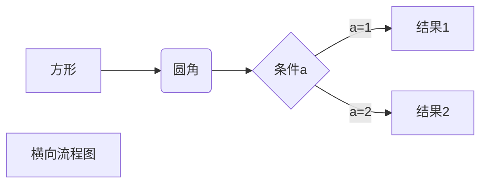
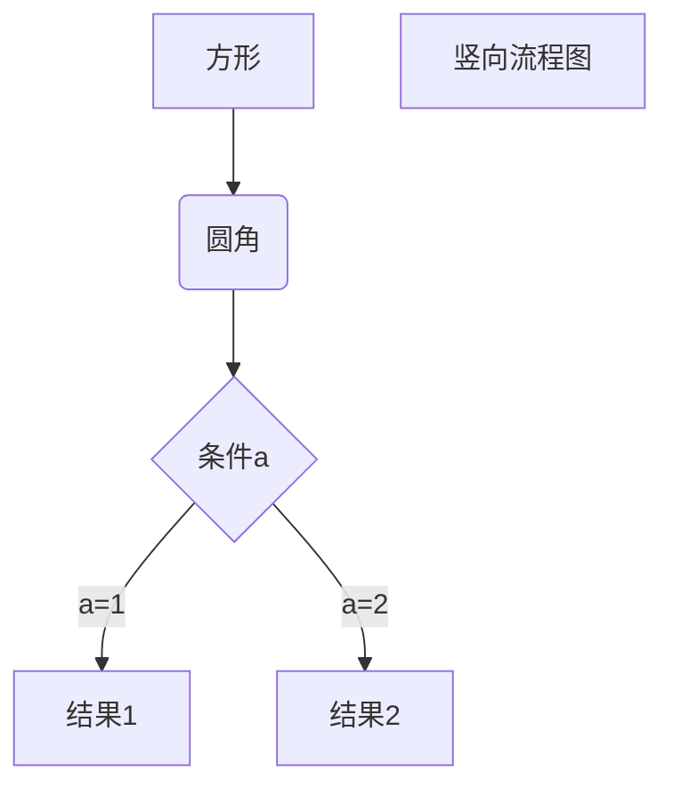
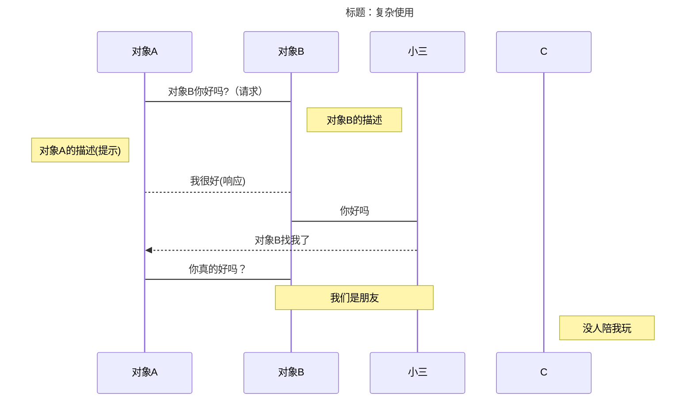
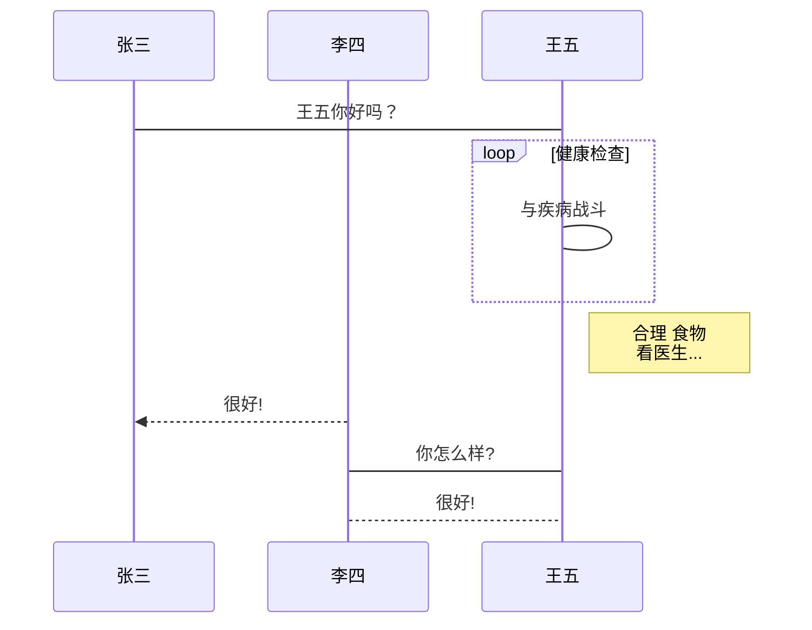
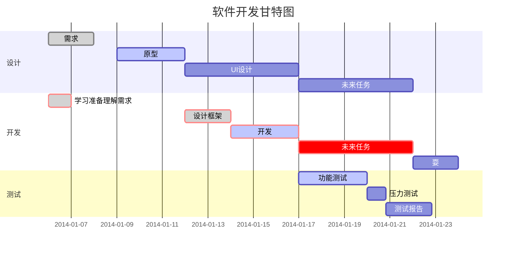

# test the nstallmarkdown

**this is bold text**
`PlugInstall` is for inline script

```python
def test(a,b):
    print(a+b)
```

---

> this is a new paragraph
>
> > new
> >
> > > sd

> > 1. sdfjsdf

> > 2. 2 line

---

<u>under line</u>

~~deleted line~~

- unorder 1
- unorder 2
- under sub 2
- under sub 3
- under sub 3

| 左对齐 | 右对齐 | 中间对齐 | 默认左对齐 |
| :----- | -----: | :------: | ---------- |
| 1      |   2323 |    3     | 2          |
| 232sdf |   2323 |   232    | 2 sfsdfs   |
| x      |   sfds |   sdfs   | sdfsdf     |
| sdfsdf | sdfsdf |  sdfsdf  | sdf        |
| sdfsdf | sdfsdf |  sdfsdf  | sdfsdf     |

_斜体_

**粗体**

1. sdfjsdf

2. sdfdsf





3、标准流程图源码格式：

```flow
st=>start: 开始框
op=>operation: 处理框
cond=>condition: 判断框(是或否?)
sub1=>subroutine: 子流程
io=>inputoutput: 输入输出框
e=>end: 结束框
st->op->cond
cond(yes)->io->e
cond(no)->sub1(right)->op
```

4、标准流程图源码格式（横向）：

```flow

st=>start: 开始框
op=>operation: 处理框
cond=>condition: 判断框(是或否?)
sub1=>subroutine: 子流程
io=>inputoutput: 输入输出框
e=>end: 结束框
st(right)->op(right)->cond
cond(yes)->io(bottom)->e
cond(no)->sub1(right)->op
```

5、UML 时序图源码样例：


6、UML 时序图源码复杂样例：



7、UML 标准时序图样例：



8、甘特图样例：



## Markdown 是什么

Markdown 是一种轻量级标记语言，创始人为约翰·格鲁伯（英语：John Gruber）。它允许人们“使用易读易写的纯文本格式编写文档，然后转换成有效的 XHTML(或者 HTML)文档”。这种语言吸收了很多在电子邮件中已有的纯文本标记的特性。

John Gruber 在 2004 年创造了 Markdown 语言，在语法上有很大一部分是跟亚伦·斯沃茨（Aaron Swartz）共同合作的。这个语言的目的是希望大家使用“易于阅读、易于撰写的纯文字格式，并选择性的转换成有效的 XHTML (或是 HTML)”。 其中最重要的设计是可读性，也就是说这个语言应该要能直接在字面上的被阅读，而不用被一些格式化指令标记 (像是 RTF 与 HTML)。 因此，它是现行电子邮件标记格式的惯例，虽然它也借鉴了很多早期的标记语言，如：setext、Texile、reStructuredText。 许多网站都使用 Markdown 或是其变种，例如：[GitHub][]、[reddit][]、[Diaspora][]、[Stack Exchange][]、[OpenStreetMap][] 与 [SourceForge][] 让用户更利于讨论。

## Markdown 概述

### 宗旨

Markdown 的目标是实现「易读易写」。可读性，无论如何，都是最重要的。一份使用 Markdown 格式撰写的文件应该可以直接以纯文本发布，并且看起来不会像是由许多标签或是格式指令所构成。

### 兼容 HTML

Markdown 中可以兼容 HTML 标签，例如插入分隔线

源码:

---

```md
下面是一条分隔线。

<hr />
这是分隔线之后。
```

效果:

---

下面是一条分隔线。

<hr />
这是分隔线之后。

## 语法说明

### 区块元素(Block)

#### 标题(h1-h6)

```md
# 这是 H1

## 这是 H2 ##(句末的闭合##可选择添加: 效果以句首的#为主)

###### 这是 H6
```

#### 段落引用

类似邮件中的`>`引用方式，md 也可以实现引用效果

源码:

---

```md
> This is a blockquote with two paragraphs. Lorem ipsum dolor sit amet,
> consectetuer adipiscing elit. Aliquam hendrerit mi posuere lectus.
>
> (或者可以只在第一行加'>')
>
> Donec sit amet nisl. Aliquam semper ipsum sit amet velit. Suspendisseid sem consectetuer libero luctus adipiscing.
>
> (引用可以嵌套)
>
> > Donec sit amet nisl. Aliquam semper ipsum sit amet velit. Suspendisseid sem consectetuer libero luctus adipiscing.
>
> (引用可以包含 md 的其他语法)
>
> 1. Red
> 1. Green
> 1. Blue
>
> - Red
> - Green
> - Blue
```

效果:

---

> This is a blockquote with two paragraphs. Lorem ipsum dolor sit amet,
> consectetuer adipiscing elit. Aliquam hendrerit mi posuere lectus.
>
> (或者可以只在第一行加'>')
>
> Donec sit amet nisl. Aliquam semper ipsum sit amet velit. Suspendisseid sem consectetuer libero luctus adipiscing.
>
> (引用可以嵌套)
>
> > Donec sit amet nisl. Aliquam semper ipsum sit amet velit. Suspendisseid sem consectetuer libero luctus adipiscing.
>
> (引用可以包含 md 的其他语法)
>
> 1. Red
> 1. Green
> 1. Blue
>
> - Red
> - Green
> - Blue

#### 列表(有序/无序)

源码:

---

```md
有序列表(数字和'.' 数字不对没关系) => HTML 的 ol 标签

1. Red
1. Gree
1. Blue

等价于

1. Red
2. Gree
3. Blue

如果在有序列表中确实需要指定的数字 必须要用'\'转义

1. 我的生日
   1991\. 我出生的年份

无序列表('\*'/'+'/'-'都可以) => HTML 的 ul 标签

- Red
- Gree
- Blue
```

效果:

---

有序列表(数字 + . 数字不对没关系) => HTML 的 ol 标签

1. Red
1. Gree
1. Blue

等价于

1. Red
2. Gree
3. Blue

如果在有序列表中确实需要指定的数字 必须要用'\'转义

1. 我的生日
   1991\. 我出生的年份

无序列表('\*'/'+'/'-'都可以) => HTML 的 ul 标签

- Red
- Gree
- Blue

#### 代码段落(```)

用\`\`\`可以实现代码段落块(markdown 和 html 一样 复数空格只会展示成一个空格 用了\`\`\`就可以展示复数个了)

```javascript
function test() {
	console.log("notice the blank line before this function?");
}
```

一些编辑器/网站实现了代码高亮，在```后可以加入语言名(比如 javascript、python 等)可以获得代码高亮的效果


#### 分隔线

源码:

```md
---
---

---

---

---
```

效果:

---

---

---

---

---

#### 表格(基本)

markdown 有简单的表格支持，实现很简单

源码:

```md
| First Header | Second Header | Third Header |
| ------------ | :-----------: | -----------: |
| Content      |  _Long Cell_  |              |
| Content      |   **Cell**    |         Cell |
```

效果:

| First Header | Second Header | Third Header |
| ------------ | :-----------: | -----------: |
| Content      |  _Long Cell_  |              |
| Content      |   **Cell**    |         Cell |

> 使用注意:
>
> 1. 每一行必须至少有一个'|'
> 1. 表格的表头和 body 之间的分隔线行只能是 |, -, =, :, ., +, 或者 空格
> 1. 表格 cell 的内容只能在一行中 不能换行
> 1. 用'|'分隔表的列
> 1. 表格内容的每行都必须从行的头部开始(避免过多的空格被其他语法解析)

> 使用 Tips:
>
> 1. 表格每行的头部/尾部的'|'可省略
> 1. 分隔线行的'-'的数量不作要求但是至少要有一个(例子中的情况是为了好看)
> 1. 一个 cell 要占用几个 column,就在 cell 后面补上对应数量的分隔线'|'，类似于使用了\<td\>的 col 属性
> 1. 表格的 cell 可以为空

### 区段元素(Inline)

#### 链接 => 等同于 a 标签

1. 行内式(链接和文字放一起)

   `This is [an example](http://example.com/ "Title") inline link.`

   This is [an example](http://example.com/ "Title") inline link.

1. 参考式(链接和文字不放在一起) => 有点类似 wiki 的引用，文章中定义，文末写明引用的外链 

   ```md
   This is [an example][id] reference-style link.
   [id]: http://example.com/ "Optional Title Here"
   ```

   实际效果:
   This is [an example][id] reference-style link.

   [id]: http://example.com/ "Optional Title Here"

   > Ps1: 上例中的 id，也可以是 1 2 3 等, 类似 wiki 的引用[1][2][3]
   >
   > Ps2: 链接还有一些[骚操作](https://www.appinn.com/markdown/#link "骚操作")就不赘述了

#### 强调

Markdown 使用星号（\*）和底线（\_）作为标记强调字词的符号，被 \* 或 \_ 包围的字词会被转成用 `<em>` 标签包围，用两个 \* 或 \_ 包起来的话，则会被转成 `<strong>`

但是*如果你的 * 和 \_ 两边都有空白的话，它们就只会被当成普通的符号。\*

源码:

---

```md
_single asterisks_

_single underscores_

**double asterisks**

**double underscores**

123 _ double asterisks _ 456
```

效果:

---

_single asterisks_

_single underscores_

**double asterisks**

**double underscores**

123 _ double asterisks _ 456

#### 代码

可以用\` \`插入代码。如果插入的代码中有\`，可以用\`\` \`\`

#### 图片 => 和链接很接近(句首多了'!') 等同 img 标签

图片也允许'行内式'和'参考式'插入。(不能设置图片大小，如需要用\)

##### 行内式

``


##### 参考式

```md
![这是图片][idx]
[idx]: https://oss.v2url.com/2018/01/03/82799c858ac0a8e0e85133b04edd5960.jpg "图片的 title"
```

![这是图片][idx]

[idx]: https://oss.v2url.com/2018/01/03/82799c858ac0a8e0e85133b04edd5960.jpg "图片的title"

## 其他

### 符号转义

markdown 语法用到了些符号，但是如果需要直接使用时要用`\`转义

```md
\ 反斜线
` 反引号

- 星号
  \_ 底线
  {} 花括号
  [] 方括号
  () 括弧

# 井字号

- 加号

* 减号
  . 英文句点
  ! 惊叹号
```

## 参考

1. [Wikipedia(可能要爬墙)](https://zh.wikipedia.org/wiki/Markdown "wiki markdown")
1. [语法说明](https://www.appinn.com/markdown "语法说明")

[github]: https://guides.github.com/features/mastering-markdown/
[reddit]: https://www.reddit.com/r/reddit.com/comments/6ewgt/reddit_markdown_primer_or_how_do_you_do_all_that/c03nik6/
[diaspora]: https://diasporafoundation.org/formatting
[stack exchange]: https://stackoverflow.com/editing-help
[openstreetmap]: https://help.openstreetmap.org/markdown_help/
[sourceforge]: https://sourceforge.net/p/forge/documentation/markdown_syntax/


times in msec
 clock   self+sourced   self:  sourced script
 clock   elapsed:              other lines

000.025  000.025: --- NVIM STARTING ---
015.110  015.085: locale set
015.939  000.829: inits 1
015.960  000.021: window checked
015.965  000.005: parsing arguments
016.392  000.427: expanding arguments
016.475  000.084: inits 2
016.901  000.425: init highlight
019.657  002.756: waiting for UI
026.106  006.448: done waiting for UI
026.122  000.016: initialized screen early for UI
034.824  002.016  002.016: sourcing /Users/lijunya/.config/nvim/autoload/plug.vim
101.141  000.045  000.045: sourcing /Users/lijunya/.config/nvim/plugged/vim-polyglot/filetype.vim
114.866  000.102  000.102: sourcing /Users/lijunya/.config/nvim/plugged/vim-polyglot/ftdetect/polyglot.vim
118.724  000.053  000.053: sourcing /Users/lijunya/.config/nvim/plugged/vim-fugitive/ftdetect/fugitive.vim
122.402  000.099  000.099: sourcing /Users/lijunya/.config/nvim/plugged/vim-markdown/ftdetect/markdown.vim
122.728  018.307  018.054: sourcing /usr/local/Cellar/neovim/0.4.4_2/share/nvim/runtime/filetype.vim
124.929  000.062  000.062: sourcing /Users/lijunya/.config/nvim/plugged/vim-polyglot/ftdetect/polyglot.vim
126.851  000.046  000.046: sourcing /Users/lijunya/.config/nvim/plugged/vim-fugitive/ftdetect/fugitive.vim
128.429  000.057  000.057: sourcing /Users/lijunya/.config/nvim/plugged/vim-markdown/ftdetect/markdown.vim
145.325  046.295  027.778: sourcing /Users/lijunya/.config/nvim/plugged/vim-polyglot/autoload/polyglot/init.vim
145.373  050.422  004.126: sourcing /Users/lijunya/.config/nvim/plugged/vim-polyglot/filetype.vim
147.836  000.095  000.095: sourcing /usr/local/Cellar/neovim/0.4.4_2/share/nvim/runtime/filetype.vim
151.310  000.090  000.090: sourcing /usr/local/Cellar/neovim/0.4.4_2/share/nvim/runtime/ftplugin.vim
154.827  000.089  000.089: sourcing /usr/local/Cellar/neovim/0.4.4_2/share/nvim/runtime/indent.vim
169.723  000.333  000.333: sourcing /usr/local/Cellar/neovim/0.4.4_2/share/nvim/runtime/syntax/syncolor.vim
169.930  005.318  004.985: sourcing /usr/local/Cellar/neovim/0.4.4_2/share/nvim/runtime/syntax/synload.vim
169.982  010.513  005.195: sourcing /usr/local/Cellar/neovim/0.4.4_2/share/nvim/runtime/syntax/syntax.vim
174.915  000.597  000.597: sourcing /usr/local/Cellar/neovim/0.4.4_2/share/nvim/runtime/syntax/nosyntax.vim
178.631  000.166  000.166: sourcing /usr/local/Cellar/neovim/0.4.4_2/share/nvim/runtime/syntax/syncolor.vim
178.812  002.032  001.866: sourcing /usr/local/Cellar/neovim/0.4.4_2/share/nvim/runtime/syntax/synload.vim
178.852  007.222  004.593: sourcing /usr/local/Cellar/neovim/0.4.4_2/share/nvim/runtime/syntax/syntax.vim
181.211  000.051  000.051: sourcing /Users/lijunya/.vim/plugged/vim-polyglot/filetype.vim
182.568  000.063  000.063: sourcing /usr/local/Cellar/neovim/0.4.4_2/share/nvim/runtime/filetype.vim
184.205  000.057  000.057: sourcing /usr/local/Cellar/neovim/0.4.4_2/share/nvim/runtime/ftplugin.vim
185.812  000.062  000.062: sourcing /Users/lijunya/.vim/plugged/vim-polyglot/filetype.vim
187.337  000.140  000.140: sourcing /usr/local/Cellar/neovim/0.4.4_2/share/nvim/runtime/filetype.vim
189.012  000.033  000.033: sourcing /usr/local/Cellar/neovim/0.4.4_2/share/nvim/runtime/indent.vim
192.514  000.222  000.222: sourcing /usr/local/Cellar/neovim/0.4.4_2/share/nvim/runtime/autoload/provider/clipboard.vim
198.502  000.185  000.185: sourcing /usr/local/Cellar/neovim/0.4.4_2/share/nvim/runtime/syntax/syncolor.vim
200.291  000.161  000.161: sourcing /usr/local/Cellar/neovim/0.4.4_2/share/nvim/runtime/syntax/syncolor.vim
205.096  008.717  008.370: sourcing /Users/lijunya/.vim/plugged/vim-monokai-tasty/colors/vim-monokai-tasty.vim
208.694  000.225  000.225: sourcing /usr/local/Cellar/neovim/0.4.4_2/share/nvim/runtime/syntax/syncolor.vim
211.284  000.253  000.253: sourcing /usr/local/Cellar/neovim/0.4.4_2/share/nvim/runtime/syntax/syncolor.vim
215.250  008.754  008.276: sourcing /Users/lijunya/.vim/plugged/vim-monokai-tasty/colors/vim-monokai-tasty.vim
219.551  000.800  000.800: sourcing /Users/lijunya/.vim/plugged/vim-repeat/autoload/repeat.vim
222.294  192.077  102.730: sourcing /Users/lijunya/.config/nvim/init.vim
222.317  004.118: sourcing vimrc file(s)
236.037  010.012  010.012: sourcing /Users/lijunya/.vim/plugged/nerdcommenter/plugin/NERD_commenter.vim
242.629  000.340  000.340: sourcing /Users/lijunya/.vim/plugged/nerdtree/autoload/nerdtree.vim
247.063  000.600  000.600: sourcing /Users/lijunya/.vim/plugged/nerdtree/lib/nerdtree/path.vim
249.558  000.148  000.148: sourcing /Users/lijunya/.vim/plugged/nerdtree/lib/nerdtree/menu_controller.vim
252.577  000.113  000.113: sourcing /Users/lijunya/.vim/plugged/nerdtree/lib/nerdtree/menu_item.vim
255.809  000.130  000.130: sourcing /Users/lijunya/.vim/plugged/nerdtree/lib/nerdtree/key_map.vim
258.489  000.241  000.241: sourcing /Users/lijunya/.vim/plugged/nerdtree/lib/nerdtree/bookmark.vim
261.950  000.317  000.317: sourcing /Users/lijunya/.vim/plugged/nerdtree/lib/nerdtree/tree_file_node.vim
264.888  000.496  000.496: sourcing /Users/lijunya/.vim/plugged/nerdtree/lib/nerdtree/tree_dir_node.vim
267.696  000.314  000.314: sourcing /Users/lijunya/.vim/plugged/nerdtree/lib/nerdtree/opener.vim
270.574  000.358  000.358: sourcing /Users/lijunya/.vim/plugged/nerdtree/lib/nerdtree/creator.vim
273.270  000.086  000.086: sourcing /Users/lijunya/.vim/plugged/nerdtree/lib/nerdtree/flag_set.vim
276.136  000.255  000.255: sourcing /Users/lijunya/.vim/plugged/nerdtree/lib/nerdtree/nerdtree.vim
279.134  000.309  000.309: sourcing /Users/lijunya/.vim/plugged/nerdtree/lib/nerdtree/ui.vim
281.978  000.056  000.056: sourcing /Users/lijunya/.vim/plugged/nerdtree/lib/nerdtree/event.vim
285.729  000.092  000.092: sourcing /Users/lijunya/.vim/plugged/nerdtree/lib/nerdtree/notifier.vim
288.954  000.527  000.527: sourcing /Users/lijunya/.vim/plugged/nerdtree/autoload/nerdtree/ui_glue.vim
298.463  000.176  000.176: sourcing /Users/lijunya/.vim/plugged/nerdtree/nerdtree_plugin/exec_menuitem.vim
302.375  000.833  000.833: sourcing /Users/lijunya/.vim/plugged/nerdtree/nerdtree_plugin/fs_menu.vim
305.113  000.084  000.084: sourcing /Users/lijunya/.vim/plugged/nerdtree/nerdtree_plugin/vcs.vim
312.126  000.109  000.109: sourcing /Users/lijunya/.vim/plugged/nerdtree-git-plugin/autoload/gitstatus.vim
316.062  000.105  000.105: sourcing /Users/lijunya/.vim/plugged/nerdtree-git-plugin/autoload/gitstatus/log.vim
319.696  000.121  000.121: sourcing /Users/lijunya/.vim/plugged/nerdtree-git-plugin/autoload/gitstatus/listener.vim
319.837  011.217  010.883: sourcing /Users/lijunya/.vim/plugged/nerdtree-git-plugin/nerdtree_plugin/git_status.vim
324.666  000.414  000.414: sourcing /Users/lijunya/.vim/plugged/vim-devicons/nerdtree_plugin/webdevicons.vim
325.354  085.672  068.565: sourcing /Users/lijunya/.vim/plugged/nerdtree/plugin/NERD_tree.vim
328.443  000.122  000.122: sourcing /Users/lijunya/.vim/plugged/vista.vim/plugin/vista.vim
331.354  000.138  000.138: sourcing /Users/lijunya/.vim/plugged/neodark.vim/plugin/neodark.vim
337.704  000.189  000.189: sourcing /Users/lijunya/.vim/plugged/vim-airline/autoload/airline/init.vim
340.742  000.270  000.270: sourcing /Users/lijunya/.vim/plugged/vim-airline/autoload/airline/parts.vim
344.113  000.075  000.075: sourcing /Users/lijunya/.vim/plugged/vim-airline/autoload/airline/formatter/short_path.vim
348.137  000.384  000.384: sourcing /Users/lijunya/.vim/plugged/vim-airline/autoload/airline/util.vim
348.425  014.004  013.086: sourcing /Users/lijunya/.vim/plugged/vim-airline/plugin/airline.vim
351.401  000.077  000.077: sourcing /Users/lijunya/.vim/plugged/vim-airline-themes/plugin/airline-themes.vim
355.593  001.474  001.474: sourcing /Users/lijunya/.fzf/plugin/fzf.vim
360.575  001.516  001.516: sourcing /Users/lijunya/.vim/plugged/fzf.vim/plugin/fzf.vim
364.090  000.329  000.329: sourcing /Users/lijunya/.vim/plugged/FixedTaskList.vim/plugin/tasklist.vim
367.057  000.136  000.136: sourcing /Users/lijunya/.vim/plugged/vim-which-key/plugin/which_key.vim
371.672  001.159  001.159: sourcing /Users/lijunya/.vim/plugged/FastFold/plugin/fastfold.vim
374.909  000.098  000.098: sourcing /Users/lijunya/.vim/plugged/leetcode.vim/plugin/leetcode.vim
381.747  000.182  000.182: sourcing /Users/lijunya/.vim/plugged/ale/autoload/ale/events.vim
382.332  004.388  004.206: sourcing /Users/lijunya/.vim/plugged/ale/plugin/ale.vim
387.660  000.038  000.038: sourcing /Users/lijunya/.vim/plugged/vim-polyglot/filetype.vim
388.783  000.035  000.035: sourcing /usr/local/Cellar/neovim/0.4.4_2/share/nvim/runtime/filetype.vim
390.235  000.031  000.031: sourcing /usr/local/Cellar/neovim/0.4.4_2/share/nvim/runtime/ftplugin.vim
390.785  004.744  004.640: sourcing /Users/lijunya/.vim/plugged/jedi-vim/plugin/jedi.vim
394.096  000.521  000.521: sourcing /Users/lijunya/.vim/plugged/vim-surround/plugin/surround.vim
397.442  000.224  000.224: sourcing /Users/lijunya/.vim/plugged/vim-indent-object/plugin/indent-object.vim
402.145  000.809  000.809: sourcing /Users/lijunya/.vim/plugged/vim-indentwise/plugin/indentwise.vim
405.490  000.167  000.167: sourcing /Users/lijunya/.vim/plugged/ack.vim/plugin/ack.vim
411.535  000.433  000.433: sourcing /Users/lijunya/.vim/plugged/colorizer/autoload/colorizer.vim
412.176  003.771  003.338: sourcing /Users/lijunya/.vim/plugged/colorizer/plugin/colorizer.vim
422.350  000.135  000.135: sourcing /usr/local/Cellar/neovim/0.4.4_2/share/nvim/runtime/autoload/provider/pythonx.vim
425.789  000.270  000.270: sourcing /usr/local/Cellar/neovim/0.4.4_2/share/nvim/runtime/autoload/remote/host.vim
425.914  006.688  006.283: sourcing /usr/local/Cellar/neovim/0.4.4_2/share/nvim/runtime/autoload/provider/python3.vim
428.813  000.059  000.059: sourcing /usr/local/Cellar/neovim/0.4.4_2/share/nvim/runtime/autoload/provider.vim
1129.368  713.047  706.301: sourcing /Users/lijunya/.vim/plugged/vim-isort/plugin/python_vimisort.vim
1854.537  678.872  678.872: sourcing /usr/local/Cellar/neovim/0.4.4_2/share/nvim/runtime/autoload/provider/python.vim
1854.654  684.135  005.264: sourcing /Users/lijunya/.vim/plugged/MatchTagAlways/plugin/MatchTagAlways.vim
1858.852  000.245  000.245: sourcing /Users/lijunya/.vim/plugged/rainbow/plugin/rainbow_main.vim
1865.188  002.503  002.503: sourcing /Users/lijunya/.vim/plugged/emmet-vim/plugin/emmet.vim
1870.721  001.718  001.718: sourcing /Users/lijunya/.vim/plugged/vim-fugitive/plugin/fugitive.vim
1874.840  000.333  000.333: sourcing /Users/lijunya/.vim/plugged/vim-signify/plugin/signify.vim
1883.504  005.140  005.140: sourcing /Users/lijunya/.vim/plugged/vim-easymotion/plugin/EasyMotion.vim
1889.881  000.271  000.271: sourcing /Users/lijunya/.vim/plugged/undotree/plugin/undotree.vim
1900.707  000.129  000.129: sourcing /Users/lijunya/.vim/plugged/dash.vim/autoload/dash/defaults.vim
1900.853  003.738  003.609: sourcing /Users/lijunya/.vim/plugged/dash.vim/autoload/dash.vim
1901.537  007.884  004.147: sourcing /Users/lijunya/.vim/plugged/dash.vim/plugin/dash.vim
1910.237  004.801  004.801: sourcing /Users/lijunya/.vim/plugged/mru/plugin/mru.vim
1914.465  000.297  000.297: sourcing /Users/lijunya/.vim/plugged/vim-easy-align/plugin/easy_align.vim
1918.278  000.083  000.083: sourcing /Users/lijunya/.vim/plugged/vim-snippets/plugin/vimsnippets.vim
1929.427  000.703  000.703: sourcing /Users/lijunya/.vim/plugged/vim-xtabline/autoload/xtabline.vim
1932.443  000.227  000.227: sourcing /Users/lijunya/.vim/plugged/vim-xtabline/autoload/xtabline/funcs.vim
1935.332  000.200  000.200: sourcing /Users/lijunya/.vim/plugged/vim-xtabline/autoload/xtabline/dir.vim
1938.444  000.137  000.137: sourcing /Users/lijunya/.vim/plugged/vim-xtabline/autoload/xtabline/hi.vim
1941.571  000.162  000.162: sourcing /Users/lijunya/.vim/plugged/vim-xtabline/autoload/xtabline/maps.vim
1946.465  000.123  000.123: sourcing /Users/lijunya/.vim/plugged/vim-xtabline/autoload/xtabline/tab.vim
1950.037  000.139  000.139: sourcing /Users/lijunya/.vim/plugged/vim-xtabline/autoload/xtabline/buffer.vim
1950.642  025.194  023.503: sourcing /Users/lijunya/.vim/plugged/vim-xtabline/autoload/xtabline/init.vim
1950.677  028.156  002.962: sourcing /Users/lijunya/.vim/plugged/vim-xtabline/plugin/xTabline.vim
1953.636  000.215  000.215: sourcing /Users/lijunya/.vim/plugged/vim-startify/plugin/startify.vim
1959.431  000.139  000.139: sourcing /Users/lijunya/.vim/plugged/coc.nvim/autoload/coc/rpc.vim
1962.759  000.581  000.581: sourcing /Users/lijunya/.vim/plugged/coc.nvim/autoload/coc/util.vim
1966.052  000.243  000.243: sourcing /Users/lijunya/.vim/plugged/coc.nvim/autoload/coc/client.vim
1972.971  016.476  015.514: sourcing /Users/lijunya/.vim/plugged/coc.nvim/plugin/coc.vim
2006.626  000.390  000.390: sourcing /Users/lijunya/.vim/plugged/vim-airline/autoload/airline.vim
2012.105  000.066  000.066: sourcing /Users/lijunya/.vim/plugged/vim-devicons/autoload/devicons/plugins/startify.vim
2012.194  010.117  009.661: sourcing /Users/lijunya/.vim/plugged/vim-devicons/plugin/webdevicons.vim
2021.883  005.731  005.731: sourcing /Users/lijunya/.vim/plugged/vim-polyglot/plugin/polyglot.vim
2027.548  000.623  000.623: sourcing /usr/local/Cellar/neovim/0.4.4_2/share/nvim/runtime/plugin/gzip.vim
2030.079  000.061  000.061: sourcing /usr/local/Cellar/neovim/0.4.4_2/share/nvim/runtime/plugin/health.vim
2033.171  000.573  000.573: sourcing /usr/local/Cellar/neovim/0.4.4_2/share/nvim/runtime/plugin/man.vim
2054.495  000.397  000.397: sourcing /usr/local/Cellar/neovim/0.4.4_2/share/nvim/runtime/pack/dist/opt/matchit/plugin/matchit.vim
2054.614  018.373  017.976: sourcing /usr/local/Cellar/neovim/0.4.4_2/share/nvim/runtime/plugin/matchit.vim
2057.342  000.231  000.231: sourcing /usr/local/Cellar/neovim/0.4.4_2/share/nvim/runtime/plugin/matchparen.vim
2060.827  001.119  001.119: sourcing /usr/local/Cellar/neovim/0.4.4_2/share/nvim/runtime/plugin/netrwPlugin.vim
2063.615  000.286  000.286: sourcing /usr/local/Cellar/neovim/0.4.4_2/share/nvim/runtime/plugin/rplugin.vim
2066.897  000.523  000.523: sourcing /usr/local/Cellar/neovim/0.4.4_2/share/nvim/runtime/plugin/shada.vim
2069.695  000.085  000.085: sourcing /usr/local/Cellar/neovim/0.4.4_2/share/nvim/runtime/plugin/spellfile.vim
2073.001  000.580  000.580: sourcing /usr/local/Cellar/neovim/0.4.4_2/share/nvim/runtime/plugin/tarPlugin.vim
2075.758  000.152  000.152: sourcing /usr/local/Cellar/neovim/0.4.4_2/share/nvim/runtime/plugin/tohtml.vim
2078.314  000.087  000.087: sourcing /usr/local/Cellar/neovim/0.4.4_2/share/nvim/runtime/plugin/tutor.vim
2081.374  000.560  000.560: sourcing /usr/local/Cellar/neovim/0.4.4_2/share/nvim/runtime/plugin/zipPlugin.vim
2081.409  225.327: loading plugins
2081.716  000.306: loading packages
2085.669  000.782  000.782: sourcing /Users/lijunya/.vim/plugged/indentLine/after/plugin/indentLine.vim
2085.747  003.250: loading after plugins
2085.760  000.012: inits 3
2091.645  005.885: reading ShaDa
2095.341  000.381  000.381: sourcing /Users/lijunya/.vim/plugged/vim-airline/autoload/airline/extensions.vim
2098.301  000.100  000.100: sourcing /Users/lijunya/.vim/plugged/vim-airline/autoload/airline/extensions/quickfix.vim
2101.256  000.083  000.083: sourcing /Users/lijunya/.vim/plugged/vim-airline/autoload/airline/extensions/netrw.vim
2104.134  000.084  000.084: sourcing /Users/lijunya/.vim/plugged/vim-airline/autoload/airline/extensions/fzf.vim
2110.326  000.116  000.116: sourcing /Users/lijunya/.vim/plugged/vim-airline/autoload/airline/section.vim
2113.874  000.290  000.290: sourcing /Users/lijunya/.vim/plugged/vim-airline/autoload/airline/highlighter.vim
2114.240  006.873  006.467: sourcing /Users/lijunya/.vim/plugged/vim-airline/autoload/airline/extensions/term.vim
2117.189  000.083  000.083: sourcing /Users/lijunya/.vim/plugged/vim-airline/autoload/airline/extensions/undotree.vim
2120.080  000.152  000.152: sourcing /Users/lijunya/.vim/plugged/vim-airline/autoload/airline/extensions/hunks.vim
2123.942  000.080  000.080: sourcing /Users/lijunya/.vim/plugged/vim-airline/autoload/airline/extensions/vista.vim
2127.164  000.332  000.332: sourcing /Users/lijunya/.vim/plugged/vim-airline/autoload/airline/extensions/branch.vim
2130.344  000.120  000.120: sourcing /Users/lijunya/.vim/plugged/vim-airline/autoload/airline/extensions/fugitiveline.vim
2133.465  000.191  000.191: sourcing /Users/lijunya/.vim/plugged/vim-airline/autoload/airline/extensions/ale.vim
2142.625  000.108  000.108: sourcing /Users/lijunya/.vim/plugged/vim-airline/autoload/airline/extensions/coc.vim
2145.943  000.123  000.123: sourcing /Users/lijunya/.vim/plugged/vim-airline/autoload/airline/extensions/po.vim
2149.048  000.148  000.148: sourcing /Users/lijunya/.vim/plugged/vim-airline/autoload/airline/extensions/wordcount.vim
2152.033  000.105  000.105: sourcing /Users/lijunya/.vim/plugged/vim-airline/autoload/airline/extensions/keymap.vim
2167.149  000.111  000.111: sourcing /Users/lijunya/.vim/plugged/vim-airline/autoload/airline/themes.vim
2167.404  003.128  003.017: sourcing /Users/lijunya/.vim/plugged/vim-airline-themes/autoload/airline/themes/papercolor.vim
2176.565  000.286  000.286: sourcing /Users/lijunya/.vim/plugged/vim-airline-themes/autoload/airline/themes/papercolor.vim
2200.009  000.191  000.191: sourcing /Users/lijunya/.vim/plugged/vim-airline/autoload/airline/builder.vim
2204.040  000.903  000.903: sourcing /Users/lijunya/.vim/plugged/vim-airline/autoload/airline/extensions/default.vim
2208.350  000.160  000.160: sourcing /Users/lijunya/.vim/plugged/vim-signify/autoload/sy.vim
2219.526  007.606  007.606: sourcing /Users/lijunya/.vim/plugged/vim-fugitive/autoload/fugitive.vim
2232.880  000.524  000.524: sourcing /Users/lijunya/.vim/plugged/ale/autoload/ale/engine.vim
2235.554  000.119  000.119: sourcing /Users/lijunya/.vim/plugged/ale/autoload/ale/statusline.vim
2253.850  140.328: opening buffers
2257.226  003.376: BufEnter autocommands
2257.231  000.005: editing files in windows
2264.188  000.887  000.887: sourcing /Users/lijunya/.vim/plugged/vim-startify/autoload/startify.vim
2268.785  000.446  000.446: sourcing /Users/lijunya/.vim/plugged/vim-startify/autoload/startify/fortune.vim
2306.472  000.287  000.287: sourcing /Users/lijunya/.vim/plugged/vim-startify/syntax/startify.vim
2311.954  000.361  000.361: sourcing /Users/lijunya/.vim/plugged/rainbow/autoload/rainbow_main.vim
2317.517  000.213  000.213: sourcing /Users/lijunya/.vim/plugged/rainbow/autoload/rainbow.vim
2326.339  000.278  000.278: sourcing /Users/lijunya/.vim/plugged/ale/autoload/ale.vim
2330.559  000.358  000.358: sourcing /Users/lijunya/.vim/plugged/ale/autoload/ale/util.vim
2344.009  010.466  010.466: sourcing /Users/lijunya/.vim/plugged/MatchTagAlways/autoload/MatchTagAlways.vim
2345.304  074.776: VimEnter autocommands
2345.309  000.005: UIEnter autocommands
2345.313  000.004: before starting main loop
2350.193  000.168  000.168: sourcing /Users/lijunya/.vim/plugged/ale/autoload/ale/cursor.vim
2356.187  000.955  000.955: sourcing /Users/lijunya/.vim/plugged/coc.nvim/autoload/coc/float.vim
2362.164  000.428  000.428: sourcing /Users/lijunya/.vim/plugged/vim-xtabline/autoload/xtabline/render.vim
2376.972  030.108: first screen update
2376.977  000.005: --- NVIM STARTED ---


times in msec
 clock   self+sourced   self:  sourced script
 clock   elapsed:              other lines

000.037  000.037: --- NVIM STARTING ---
017.298  017.261: locale set
018.132  000.834: inits 1
018.153  000.021: window checked
018.158  000.005: parsing arguments
018.598  000.440: expanding arguments
018.680  000.083: inits 2
019.093  000.413: init highlight
021.832  002.739: waiting for UI
028.522  006.690: done waiting for UI
028.539  000.017: initialized screen early for UI
037.779  001.700  001.700: sourcing /Users/lijunya/.config/nvim/autoload/plug.vim
057.369  000.037  000.037: sourcing /Users/lijunya/.config/nvim/plugged/vim-polyglot/filetype.vim
071.849  000.058  000.058: sourcing /Users/lijunya/.config/nvim/plugged/vim-polyglot/ftdetect/polyglot.vim
075.738  000.049  000.049: sourcing /Users/lijunya/.config/nvim/plugged/vim-fugitive/ftdetect/fugitive.vim
082.049  000.176  000.176: sourcing /Users/lijunya/.config/nvim/plugged/vim-markdown/ftdetect/markdown.vim
082.691  020.806  020.523: sourcing /usr/local/Cellar/neovim/0.4.4_2/share/nvim/runtime/filetype.vim
085.134  000.044  000.044: sourcing /Users/lijunya/.config/nvim/plugged/vim-polyglot/ftdetect/polyglot.vim
087.140  000.044  000.044: sourcing /Users/lijunya/.config/nvim/plugged/vim-fugitive/ftdetect/fugitive.vim
088.897  000.074  000.074: sourcing /Users/lijunya/.config/nvim/plugged/vim-markdown/ftdetect/markdown.vim
106.566  051.247  030.242: sourcing /Users/lijunya/.config/nvim/plugged/vim-polyglot/autoload/polyglot/init.vim
106.627  054.988  003.740: sourcing /Users/lijunya/.config/nvim/plugged/vim-polyglot/filetype.vim
109.147  000.052  000.052: sourcing /usr/local/Cellar/neovim/0.4.4_2/share/nvim/runtime/filetype.vim
113.164  000.111  000.111: sourcing /usr/local/Cellar/neovim/0.4.4_2/share/nvim/runtime/ftplugin.vim
117.013  000.124  000.124: sourcing /usr/local/Cellar/neovim/0.4.4_2/share/nvim/runtime/indent.vim
129.976  000.276  000.276: sourcing /usr/local/Cellar/neovim/0.4.4_2/share/nvim/runtime/syntax/syncolor.vim
130.169  003.823  003.547: sourcing /usr/local/Cellar/neovim/0.4.4_2/share/nvim/runtime/syntax/synload.vim
130.215  010.108  006.285: sourcing /usr/local/Cellar/neovim/0.4.4_2/share/nvim/runtime/syntax/syntax.vim
135.320  000.648  000.648: sourcing /usr/local/Cellar/neovim/0.4.4_2/share/nvim/runtime/syntax/nosyntax.vim
139.511  000.193  000.193: sourcing /usr/local/Cellar/neovim/0.4.4_2/share/nvim/runtime/syntax/syncolor.vim
139.693  002.298  002.105: sourcing /usr/local/Cellar/neovim/0.4.4_2/share/nvim/runtime/syntax/synload.vim
139.732  007.909  004.963: sourcing /usr/local/Cellar/neovim/0.4.4_2/share/nvim/runtime/syntax/syntax.vim
141.451  000.060  000.060: sourcing /Users/lijunya/.vim/plugged/vim-polyglot/filetype.vim
142.916  000.040  000.040: sourcing /usr/local/Cellar/neovim/0.4.4_2/share/nvim/runtime/filetype.vim
144.535  000.035  000.035: sourcing /usr/local/Cellar/neovim/0.4.4_2/share/nvim/runtime/ftplugin.vim
146.108  000.035  000.035: sourcing /Users/lijunya/.vim/plugged/vim-polyglot/filetype.vim
147.180  000.035  000.035: sourcing /usr/local/Cellar/neovim/0.4.4_2/share/nvim/runtime/filetype.vim
148.600  000.031  000.031: sourcing /usr/local/Cellar/neovim/0.4.4_2/share/nvim/runtime/indent.vim
151.564  000.216  000.216: sourcing /usr/local/Cellar/neovim/0.4.4_2/share/nvim/runtime/autoload/provider/clipboard.vim
158.046  000.219  000.219: sourcing /usr/local/Cellar/neovim/0.4.4_2/share/nvim/runtime/syntax/syncolor.vim
159.845  000.151  000.151: sourcing /usr/local/Cellar/neovim/0.4.4_2/share/nvim/runtime/syntax/syncolor.vim
164.138  008.699  008.329: sourcing /Users/lijunya/.vim/plugged/vim-monokai-tasty/colors/vim-monokai-tasty.vim
167.198  000.218  000.218: sourcing /usr/local/Cellar/neovim/0.4.4_2/share/nvim/runtime/syntax/syncolor.vim
169.346  000.202  000.202: sourcing /usr/local/Cellar/neovim/0.4.4_2/share/nvim/runtime/syntax/syncolor.vim
173.265  008.048  007.629: sourcing /Users/lijunya/.vim/plugged/vim-monokai-tasty/colors/vim-monokai-tasty.vim
179.353  000.608  000.608: sourcing /Users/lijunya/.vim/plugged/vim-repeat/autoload/repeat.vim
180.095  147.107  054.308: sourcing /Users/lijunya/.config/nvim/init.vim
180.116  004.470: sourcing vimrc file(s)
189.057  004.979  004.979: sourcing /Users/lijunya/.vim/plugged/nerdcommenter/plugin/NERD_commenter.vim
195.995  000.294  000.294: sourcing /Users/lijunya/.vim/plugged/nerdtree/autoload/nerdtree.vim
199.832  000.592  000.592: sourcing /Users/lijunya/.vim/plugged/nerdtree/lib/nerdtree/path.vim
203.176  000.152  000.152: sourcing /Users/lijunya/.vim/plugged/nerdtree/lib/nerdtree/menu_controller.vim
206.274  000.100  000.100: sourcing /Users/lijunya/.vim/plugged/nerdtree/lib/nerdtree/menu_item.vim
209.292  000.121  000.121: sourcing /Users/lijunya/.vim/plugged/nerdtree/lib/nerdtree/key_map.vim
212.135  000.244  000.244: sourcing /Users/lijunya/.vim/plugged/nerdtree/lib/nerdtree/bookmark.vim
216.396  000.357  000.357: sourcing /Users/lijunya/.vim/plugged/nerdtree/lib/nerdtree/tree_file_node.vim
219.972  000.567  000.567: sourcing /Users/lijunya/.vim/plugged/nerdtree/lib/nerdtree/tree_dir_node.vim
223.624  000.224  000.224: sourcing /Users/lijunya/.vim/plugged/nerdtree/lib/nerdtree/opener.vim
226.830  000.240  000.240: sourcing /Users/lijunya/.vim/plugged/nerdtree/lib/nerdtree/creator.vim
229.900  000.091  000.091: sourcing /Users/lijunya/.vim/plugged/nerdtree/lib/nerdtree/flag_set.vim
232.984  000.221  000.221: sourcing /Users/lijunya/.vim/plugged/nerdtree/lib/nerdtree/nerdtree.vim
236.285  000.307  000.307: sourcing /Users/lijunya/.vim/plugged/nerdtree/lib/nerdtree/ui.vim
239.258  000.069  000.069: sourcing /Users/lijunya/.vim/plugged/nerdtree/lib/nerdtree/event.vim
242.533  000.081  000.081: sourcing /Users/lijunya/.vim/plugged/nerdtree/lib/nerdtree/notifier.vim
246.039  000.541  000.541: sourcing /Users/lijunya/.vim/plugged/nerdtree/autoload/nerdtree/ui_glue.vim
255.685  000.135  000.135: sourcing /Users/lijunya/.vim/plugged/nerdtree/nerdtree_plugin/exec_menuitem.vim
259.595  000.864  000.864: sourcing /Users/lijunya/.vim/plugged/nerdtree/nerdtree_plugin/fs_menu.vim
262.554  000.088  000.088: sourcing /Users/lijunya/.vim/plugged/nerdtree/nerdtree_plugin/vcs.vim
269.587  000.120  000.120: sourcing /Users/lijunya/.vim/plugged/nerdtree-git-plugin/autoload/gitstatus.vim
272.846  000.096  000.096: sourcing /Users/lijunya/.vim/plugged/nerdtree-git-plugin/autoload/gitstatus/log.vim
277.102  000.128  000.128: sourcing /Users/lijunya/.vim/plugged/nerdtree-git-plugin/autoload/gitstatus/listener.vim
277.265  011.016  010.672: sourcing /Users/lijunya/.vim/plugged/nerdtree-git-plugin/nerdtree_plugin/git_status.vim
282.333  000.437  000.437: sourcing /Users/lijunya/.vim/plugged/vim-devicons/nerdtree_plugin/webdevicons.vim
283.021  090.355  073.616: sourcing /Users/lijunya/.vim/plugged/nerdtree/plugin/NERD_tree.vim
287.097  000.159  000.159: sourcing /Users/lijunya/.vim/plugged/vista.vim/plugin/vista.vim
290.260  000.140  000.140: sourcing /Users/lijunya/.vim/plugged/neodark.vim/plugin/neodark.vim
296.253  000.176  000.176: sourcing /Users/lijunya/.vim/plugged/vim-airline/autoload/airline/init.vim
299.264  000.280  000.280: sourcing /Users/lijunya/.vim/plugged/vim-airline/autoload/airline/parts.vim
303.302  000.073  000.073: sourcing /Users/lijunya/.vim/plugged/vim-airline/autoload/airline/formatter/short_path.vim
307.364  000.391  000.391: sourcing /Users/lijunya/.vim/plugged/vim-airline/autoload/airline/util.vim
307.714  014.550  013.630: sourcing /Users/lijunya/.vim/plugged/vim-airline/plugin/airline.vim
310.841  000.075  000.075: sourcing /Users/lijunya/.vim/plugged/vim-airline-themes/plugin/airline-themes.vim
315.298  001.499  001.499: sourcing /Users/lijunya/.fzf/plugin/fzf.vim
320.741  001.606  001.606: sourcing /Users/lijunya/.vim/plugged/fzf.vim/plugin/fzf.vim
324.183  000.324  000.324: sourcing /Users/lijunya/.vim/plugged/FixedTaskList.vim/plugin/tasklist.vim
327.468  000.137  000.137: sourcing /Users/lijunya/.vim/plugged/vim-which-key/plugin/which_key.vim
331.265  000.877  000.877: sourcing /Users/lijunya/.vim/plugged/FastFold/plugin/fastfold.vim
334.408  000.094  000.094: sourcing /Users/lijunya/.vim/plugged/leetcode.vim/plugin/leetcode.vim
340.942  000.187  000.187: sourcing /Users/lijunya/.vim/plugged/ale/autoload/ale/events.vim
341.502  003.988  003.801: sourcing /Users/lijunya/.vim/plugged/ale/plugin/ale.vim
346.892  000.044  000.044: sourcing /Users/lijunya/.vim/plugged/vim-polyglot/filetype.vim
348.212  000.040  000.040: sourcing /usr/local/Cellar/neovim/0.4.4_2/share/nvim/runtime/filetype.vim
350.259  000.045  000.045: sourcing /usr/local/Cellar/neovim/0.4.4_2/share/nvim/runtime/ftplugin.vim
350.822  005.867  005.739: sourcing /Users/lijunya/.vim/plugged/jedi-vim/plugin/jedi.vim
354.216  000.531  000.531: sourcing /Users/lijunya/.vim/plugged/vim-surround/plugin/surround.vim
357.271  000.212  000.212: sourcing /Users/lijunya/.vim/plugged/vim-indent-object/plugin/indent-object.vim
360.829  000.797  000.797: sourcing /Users/lijunya/.vim/plugged/vim-indentwise/plugin/indentwise.vim
363.899  000.160  000.160: sourcing /Users/lijunya/.vim/plugged/ack.vim/plugin/ack.vim
369.897  000.376  000.376: sourcing /Users/lijunya/.vim/plugged/colorizer/autoload/colorizer.vim
370.550  003.943  003.567: sourcing /Users/lijunya/.vim/plugged/colorizer/plugin/colorizer.vim
381.427  000.145  000.145: sourcing /usr/local/Cellar/neovim/0.4.4_2/share/nvim/runtime/autoload/provider/pythonx.vim
384.770  000.377  000.377: sourcing /usr/local/Cellar/neovim/0.4.4_2/share/nvim/runtime/autoload/remote/host.vim
384.893  006.921  006.400: sourcing /usr/local/Cellar/neovim/0.4.4_2/share/nvim/runtime/autoload/provider/python3.vim
387.878  000.060  000.060: sourcing /usr/local/Cellar/neovim/0.4.4_2/share/nvim/runtime/autoload/provider.vim
1094.005  719.139  712.158: sourcing /Users/lijunya/.vim/plugged/vim-isort/plugin/python_vimisort.vim
1765.351  665.763  665.763: sourcing /usr/local/Cellar/neovim/0.4.4_2/share/nvim/runtime/autoload/provider/python.vim
1765.460  668.677  002.914: sourcing /Users/lijunya/.vim/plugged/MatchTagAlways/plugin/MatchTagAlways.vim
1769.736  000.252  000.252: sourcing /Users/lijunya/.vim/plugged/rainbow/plugin/rainbow_main.vim
1776.932  002.578  002.578: sourcing /Users/lijunya/.vim/plugged/emmet-vim/plugin/emmet.vim
1782.710  001.846  001.846: sourcing /Users/lijunya/.vim/plugged/vim-fugitive/plugin/fugitive.vim
1786.678  000.262  000.262: sourcing /Users/lijunya/.vim/plugged/vim-signify/plugin/signify.vim
1795.809  005.578  005.578: sourcing /Users/lijunya/.vim/plugged/vim-easymotion/plugin/EasyMotion.vim
1799.509  000.196  000.196: sourcing /Users/lijunya/.vim/plugged/undotree/plugin/undotree.vim
1811.123  000.150  000.150: sourcing /Users/lijunya/.vim/plugged/dash.vim/autoload/dash/defaults.vim
1811.308  004.377  004.227: sourcing /Users/lijunya/.vim/plugged/dash.vim/autoload/dash.vim
1812.069  008.596  004.219: sourcing /Users/lijunya/.vim/plugged/dash.vim/plugin/dash.vim
1820.681  004.667  004.667: sourcing /Users/lijunya/.vim/plugged/mru/plugin/mru.vim
1824.949  000.477  000.477: sourcing /Users/lijunya/.vim/plugged/vim-easy-align/plugin/easy_align.vim
1828.301  000.072  000.072: sourcing /Users/lijunya/.vim/plugged/vim-snippets/plugin/vimsnippets.vim
1839.972  000.661  000.661: sourcing /Users/lijunya/.vim/plugged/vim-xtabline/autoload/xtabline.vim
1843.309  000.250  000.250: sourcing /Users/lijunya/.vim/plugged/vim-xtabline/autoload/xtabline/funcs.vim
1846.370  000.197  000.197: sourcing /Users/lijunya/.vim/plugged/vim-xtabline/autoload/xtabline/dir.vim
1849.422  000.155  000.155: sourcing /Users/lijunya/.vim/plugged/vim-xtabline/autoload/xtabline/hi.vim
1853.107  000.158  000.158: sourcing /Users/lijunya/.vim/plugged/vim-xtabline/autoload/xtabline/maps.vim
1857.054  000.159  000.159: sourcing /Users/lijunya/.vim/plugged/vim-xtabline/autoload/xtabline/tab.vim
1861.336  000.143  000.143: sourcing /Users/lijunya/.vim/plugged/vim-xtabline/autoload/xtabline/buffer.vim
1862.158  027.477  025.754: sourcing /Users/lijunya/.vim/plugged/vim-xtabline/autoload/xtabline/init.vim
1862.193  030.712  003.235: sourcing /Users/lijunya/.vim/plugged/vim-xtabline/plugin/xTabline.vim
1865.701  000.251  000.251: sourcing /Users/lijunya/.vim/plugged/vim-startify/plugin/startify.vim
1873.628  000.139  000.139: sourcing /Users/lijunya/.vim/plugged/coc.nvim/autoload/coc/rpc.vim
1877.183  000.698  000.698: sourcing /Users/lijunya/.vim/plugged/coc.nvim/autoload/coc/util.vim
1880.501  000.241  000.241: sourcing /Users/lijunya/.vim/plugged/coc.nvim/autoload/coc/client.vim
1887.508  018.314  017.236: sourcing /Users/lijunya/.vim/plugged/coc.nvim/plugin/coc.vim
1923.449  000.301  000.301: sourcing /Users/lijunya/.vim/plugged/vim-airline/autoload/airline.vim
1929.709  000.065  000.065: sourcing /Users/lijunya/.vim/plugged/vim-devicons/autoload/devicons/plugins/startify.vim
1929.788  012.571  012.205: sourcing /Users/lijunya/.vim/plugged/vim-devicons/plugin/webdevicons.vim
1939.491  005.379  005.379: sourcing /Users/lijunya/.vim/plugged/vim-polyglot/plugin/polyglot.vim
1943.931  000.548  000.548: sourcing /usr/local/Cellar/neovim/0.4.4_2/share/nvim/runtime/plugin/gzip.vim
1946.545  000.063  000.063: sourcing /usr/local/Cellar/neovim/0.4.4_2/share/nvim/runtime/plugin/health.vim
1949.390  000.412  000.412: sourcing /usr/local/Cellar/neovim/0.4.4_2/share/nvim/runtime/plugin/man.vim
1972.194  000.400  000.400: sourcing /usr/local/Cellar/neovim/0.4.4_2/share/nvim/runtime/pack/dist/opt/matchit/plugin/matchit.vim
1972.324  016.714  016.314: sourcing /usr/local/Cellar/neovim/0.4.4_2/share/nvim/runtime/plugin/matchit.vim
1975.120  000.232  000.232: sourcing /usr/local/Cellar/neovim/0.4.4_2/share/nvim/runtime/plugin/matchparen.vim
1980.345  001.058  001.058: sourcing /usr/local/Cellar/neovim/0.4.4_2/share/nvim/runtime/plugin/netrwPlugin.vim
1983.352  000.264  000.264: sourcing /usr/local/Cellar/neovim/0.4.4_2/share/nvim/runtime/plugin/rplugin.vim
1986.537  000.464  000.464: sourcing /usr/local/Cellar/neovim/0.4.4_2/share/nvim/runtime/plugin/shada.vim
1989.186  000.090  000.090: sourcing /usr/local/Cellar/neovim/0.4.4_2/share/nvim/runtime/plugin/spellfile.vim
1992.139  000.519  000.519: sourcing /usr/local/Cellar/neovim/0.4.4_2/share/nvim/runtime/plugin/tarPlugin.vim
1995.064  000.163  000.163: sourcing /usr/local/Cellar/neovim/0.4.4_2/share/nvim/runtime/plugin/tohtml.vim
1997.861  000.084  000.084: sourcing /usr/local/Cellar/neovim/0.4.4_2/share/nvim/runtime/plugin/tutor.vim
2001.744  000.549  000.549: sourcing /usr/local/Cellar/neovim/0.4.4_2/share/nvim/runtime/plugin/zipPlugin.vim
2001.792  190.650: loading plugins
2002.215  000.423: loading packages
2006.275  000.759  000.759: sourcing /Users/lijunya/.vim/plugged/indentLine/after/plugin/indentLine.vim
2006.365  003.391: loading after plugins
2006.377  000.012: inits 3
2012.638  006.261: reading ShaDa
2016.975  000.466  000.466: sourcing /Users/lijunya/.vim/plugged/vim-airline/autoload/airline/extensions.vim
2022.133  000.143  000.143: sourcing /Users/lijunya/.vim/plugged/vim-airline/autoload/airline/extensions/quickfix.vim
2025.945  000.099  000.099: sourcing /Users/lijunya/.vim/plugged/vim-airline/autoload/airline/extensions/netrw.vim
2029.685  000.093  000.093: sourcing /Users/lijunya/.vim/plugged/vim-airline/autoload/airline/extensions/fzf.vim
2039.491  000.184  000.184: sourcing /Users/lijunya/.vim/plugged/vim-airline/autoload/airline/section.vim
2044.495  000.471  000.471: sourcing /Users/lijunya/.vim/plugged/vim-airline/autoload/airline/highlighter.vim
2045.069  011.037  010.382: sourcing /Users/lijunya/.vim/plugged/vim-airline/autoload/airline/extensions/term.vim
2049.292  000.108  000.108: sourcing /Users/lijunya/.vim/plugged/vim-airline/autoload/airline/extensions/undotree.vim
2054.094  000.183  000.183: sourcing /Users/lijunya/.vim/plugged/vim-airline/autoload/airline/extensions/hunks.vim
2057.795  000.083  000.083: sourcing /Users/lijunya/.vim/plugged/vim-airline/autoload/airline/extensions/vista.vim
2061.426  000.291  000.291: sourcing /Users/lijunya/.vim/plugged/vim-airline/autoload/airline/extensions/branch.vim
2064.892  000.121  000.121: sourcing /Users/lijunya/.vim/plugged/vim-airline/autoload/airline/extensions/fugitiveline.vim
2068.158  000.175  000.175: sourcing /Users/lijunya/.vim/plugged/vim-airline/autoload/airline/extensions/ale.vim
2077.691  000.115  000.115: sourcing /Users/lijunya/.vim/plugged/vim-airline/autoload/airline/extensions/coc.vim
2080.834  000.117  000.117: sourcing /Users/lijunya/.vim/plugged/vim-airline/autoload/airline/extensions/po.vim
2084.607  000.150  000.150: sourcing /Users/lijunya/.vim/plugged/vim-airline/autoload/airline/extensions/wordcount.vim
2087.811  000.087  000.087: sourcing /Users/lijunya/.vim/plugged/vim-airline/autoload/airline/extensions/keymap.vim
2104.502  000.113  000.113: sourcing /Users/lijunya/.vim/plugged/vim-airline/autoload/airline/themes.vim
2104.738  004.158  004.044: sourcing /Users/lijunya/.vim/plugged/vim-airline-themes/autoload/airline/themes/papercolor.vim
2116.724  000.290  000.290: sourcing /Users/lijunya/.vim/plugged/vim-airline-themes/autoload/airline/themes/papercolor.vim
2138.530  000.199  000.199: sourcing /Users/lijunya/.vim/plugged/vim-airline/autoload/airline/builder.vim
2142.791  000.156  000.156: sourcing /Users/lijunya/.vim/plugged/vim-airline/autoload/airline/extensions/default.vim
2147.772  000.197  000.197: sourcing /Users/lijunya/.vim/plugged/vim-signify/autoload/sy.vim
2158.083  006.096  006.096: sourcing /Users/lijunya/.vim/plugged/vim-fugitive/autoload/fugitive.vim
2173.966  000.625  000.625: sourcing /Users/lijunya/.vim/plugged/ale/autoload/ale/engine.vim
2177.520  000.128  000.128: sourcing /Users/lijunya/.vim/plugged/ale/autoload/ale/statusline.vim
2196.259  158.506: opening buffers
2199.568  003.309: BufEnter autocommands
2199.574  000.005: editing files in windows
2205.123  000.905  000.905: sourcing /Users/lijunya/.vim/plugged/vim-startify/autoload/startify.vim
2209.967  000.405  000.405: sourcing /Users/lijunya/.vim/plugged/vim-startify/autoload/startify/fortune.vim
2243.163  000.278  000.278: sourcing /Users/lijunya/.vim/plugged/vim-startify/syntax/startify.vim
2247.507  000.184  000.184: sourcing /Users/lijunya/.vim/plugged/rainbow/autoload/rainbow_main.vim
2250.437  000.135  000.135: sourcing /Users/lijunya/.vim/plugged/rainbow/autoload/rainbow.vim
2259.474  000.265  000.265: sourcing /Users/lijunya/.vim/plugged/ale/autoload/ale.vim
2262.410  000.341  000.341: sourcing /Users/lijunya/.vim/plugged/ale/autoload/ale/util.vim
2274.904  009.829  009.829: sourcing /Users/lijunya/.vim/plugged/MatchTagAlways/autoload/MatchTagAlways.vim
2276.023  064.107: VimEnter autocommands
2276.029  000.007: UIEnter autocommands
2276.034  000.005: before starting main loop
2279.467  000.162  000.162: sourcing /Users/lijunya/.vim/plugged/ale/autoload/ale/cursor.vim
2284.564  000.941  000.941: sourcing /Users/lijunya/.vim/plugged/coc.nvim/autoload/coc/float.vim
2290.512  000.428  000.428: sourcing /Users/lijunya/.vim/plugged/vim-xtabline/autoload/xtabline/render.vim
2308.874  031.310: first screen update
2308.879  000.005: --- NVIM STARTED ---
